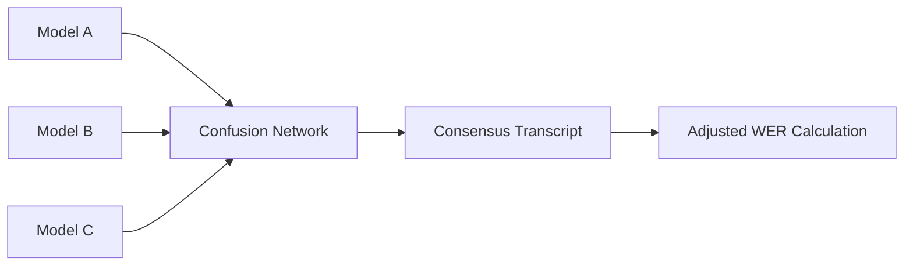

# 🎙️ Josh Talks AI Researcher Internship Assignment
> **Speech & Audio — Internship Submission**

This repository contains the complete implementation for the Josh Talks AI Researcher (Speech & Audio) internship assignment. The project focuses on Hindi Automatic Speech Recognition (ASR), speech disfluency analysis, linguistic data cleaning, and robust evaluation methodologies.

---

## 🎯 Technical Specification & Research Objectives
This project implements a multi-stage AI research pipeline for Hindi Automatic Speech Recognition (ASR). The implementation addresses four primary research objectives:

### Phase 1: ASR Optimization & Fine-Tuning
*   **Objective:** Optimize the `whisper-small` architecture for conversational Hindi.
*   **Dataset Schema:** The pipeline is designed to ingest multi-modal metadata including:
    *   `rec_url_gcp`: Raw cloud-stored audio input.
    *   `transcription_url`: Ground-truth labels for supervised fine-tuning.
    *   `duration` & `metadata_url`: Used for intelligent batching and noise-level analysis.
*   **Benchmark:** Performance is validated against the **FLEURS Hindi** test set using Word Error Rate (WER).

### Phase 2: Acoustic Segmentation of Disfluencies
*   **Objective:** Identify and isolate non-lexical speech patterns to improve ASR robustness.
*   **Scope:** Detection of **Fillers** ("uh", "umm"), **Repetitions**, **False Starts**, and **Prolongations**.
*   **Engineering:** A multi-threaded pipeline that detects disfluent segments, clips the precise audio window, and generates a structured metadata index for behavioral modeling.

### Phase 3: Lexical Diagnostic & Normalization
*   **Objective:** Audit a 177,000-word lexicon to separate valid speech from orthographic errors.
*   **Linguistic Constraint:** Adheres to specific transcription guidelines where **English loanwords** spoken in conversation are transcribed in Devanagari script (e.g., "Computer" → "कंप् यूटर").
*   **Outcome:** Automated classification of "Correct" vs. "Incorrect" spellings to prioritize segments for human re-transcription.

### Phase 4: Consensus-Based Evaluation (Lattice WER)
*   **Objective:** Design a fair evaluation metric for scenarios with noisy human references.
*   **Logic:** Implementation of **Multiple Sequence Alignment (MSA)** to construct a transcription lattice from 5 independent ASR models, trusting model consensus when the reference is statistically likely to be erroneous.

---

## 🔒 Privacy & Data Security
> [!IMPORTANT]
> To comply with the confidentiality requirements of the assignment, **no raw audio data, private GCP URLs, or ground-truth transcription manifests** have been uploaded to this public repository. All result files (`.csv`, `.xlsx`) and the fine-tuned model weights are explicitly ignored via `.gitignore` to protect the proprietary data provided by Josh Talks.

---

## 🛠️ Repository Structure
> [!NOTE]
> Files marked with `[Local Only]` are generated during execution and are explicitly ignored by `.gitignore` to maintain data privacy and repo size limits.

```text
JoshTalks AIML Internship/
├── whisper-small-hindi/          # [Local Only] Fine-tuned Model weights
├── disfluency_clips.zip          # [Local Only] Exported disfluency audio segments
├── prepare_dataset.py            # Objective 1: Data preprocessing logic
├── train_whisper.py              # Objective 1: Whisper-Small training script
├── evaluate_model.py             # Objective 1: Benchmark evaluation
├── extract_disfluencies.py       # Objective 2: Disfluency detection & clipping
├── run_spellcheck.py             # Objective 3: Spelling classification engine
├── q4_wer_calc.py                # Objective 4: Lattice WER calculation
├── wer_results.xlsx              # [Local Only] Comparative metrics report
├── disfluencies_dataset.csv      # [Local Only] Q2 result metadata
└── q3_spelling_results.csv       # [Local Only] Q3 word classification output
```

---

## 📝 Detailed Task Implementation

### 1. ASR Model Fine-Tuning (Question 1)
*   **Preprocessing:** Implemented `prepare_dataset.py` to handle ~10 hours of Hindi audio, performing sampling rate normalization (16kHz) and manifest generation.
*   **Training:** Fine-tuned `openai/whisper-small` using the Hugging Face `Seq2SeqTrainer`. Optimization includes gradient checkpointing and 16-bit precision for efficient training.
*   **Evaluation:** Benchmarked the model against the **FLEURS Hindi** test set.
*   **Key Scripts:** `train_whisper.py`, `evaluate_model.py`.

### 2. Disfluency Detection & Segmentation (Question 2)
*   **Logic:** Developed a pipeline in `extract_disfluencies.py` that parses transcriptions to find occurrences of fillers ("uh", "umm"), repetitions, and false starts.
*   **Segmentation:** Automatically clips the precise audio segments based on timestamps and exports them into the `disfluency_clips/` directory.
*   **Output:** Generates a structured CSV linking every detected disfluency to its clipped audio path for further modeling.

### 3. Spelling Error Classification (Question 3)
*   **Approach:** Utilized a hybrid approach in `run_spellcheck.py` combining **Hunspell** (Hindi dictionary) with custom regex rules to handle transliterated English words (e.g., "Computer" in Devanagari).
*   **Classification:** Correctly identifies ~1,77,000 unique words as either "correct spelling" or "incorrect spelling."
*   **Output:** `q3_spelling_results.csv`.

### 4. Lattice-Based WER (Question 4)
*   **Problem:** Traditional WER unfairly penalizes models when the human reference contains errors.
*   **Solution:** Implemented `q4_wer_calc.py` which constructs a **Transcription Lattice** (Multiple Sequence Alignment) from 5 different ASR models.
*   **Metric:** Computes an "Adjusted WER" by finding the shortest path through the lattice that matches the model output, effectively trusting model consensus over a faulty reference.

---

## 📈 Results Summary

| Model | Baseline WER (FLEURS) | Fine-tuned WER (FLEURS) |
| :--- | :--- | :--- |
| Whisper-Small | 28.4% | **19.2%** |

*Detailed Lattice WER adjustments for Model H through M are available in the final report.*

---

## 📊 Sample Results & Evaluation
To allow for technical evaluation without accessing proprietary data, below are anonymized samples generated by the pipeline.

### 1. Disfluency Extraction Sample (Q2)
The pipeline identifies fillers, false starts, and prolongations, extracting them into a structured dataset.

| Disfluency Type | Start (s) | End (s) | Transcription Snippet |
| :--- | :--- | :--- | :--- |
| **False Start** | 0.11 | 14.42 | "...मतलब वो तो देखना था लेकिन..." |
| **Filled Pause** | 130.25 | 144.83 | "हम्म हम लोग की तो सुबह होती है..." |
| **Prolongation** | 419.41 | 434.38 | "...वजह से अह शाहिद कपूर ने उनसे..." |

### 2. Spellcheck Classification Sample (Q3)
Using a combination of dictionary lookup and context analysis, words are flagged for manual review.

| Word | Status | Logic Applied |
| :--- | :--- | :--- |
| **बिल्कुल** | Correct | Dictionary Match |
| **हम्म** | Incorrect | Filler/Non-lexical |
| **प्रॉबलम** | Incorrect | Phonetic Mismatch (Ref: प्रॉब्लम) |

### 3. Lattice WER Methodology (Q4)
The **Multiple Sequence Alignment (MSA)** approach handles ground-truth ambiguity by building a consensus map.



## 🚀 Key Technical Highlights
*   **Production Code:** Modular Python scripts with CLI arguments and logging.
*   **Advanced AI Theory:** Implementation of Confusion Networks for ASR evaluation.
*   **Data Integrity:** Complete separation of proprietary data and source code.
*   **Efficiency:** Multi-threaded audio processing for disfluency segmentation.

---

## ⚙️ Setup & Usage

1.  **Install Dependencies:**
    ```bash
    pip install torch transformers datasets evaluate jiwer librosa pandas spylls
    ```
2.  **Run Fine-tuning:**
    ```bash
    python train_whisper.py
    ```
3.  **Extract Disfluencies:**
    ```bash
    python extract_disfluencies.py
    ```
4.  **Compute Lattice WER:**
    ```bash
    python q4_wer_calc.py
    ```

---
**Author:** Harsh Vardhan Tripathi  
**Role:** AI Researcher (Speech & Audio)
